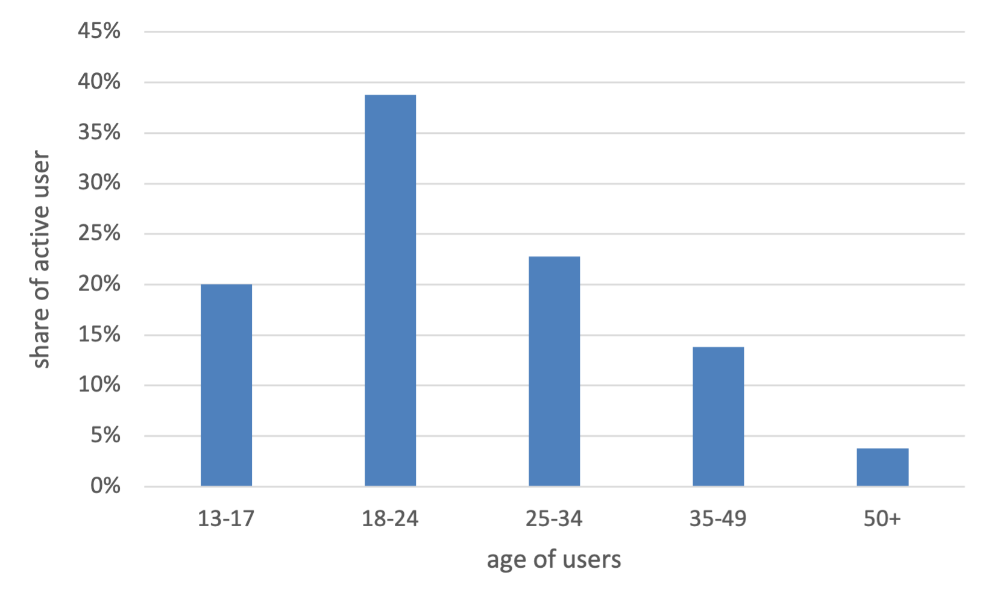

authors: **Lukas Zimmermann**, **Cyril Gabriele**

In a world where AI is increasingly becoming part of our everyday lives, the issue of 'humanising' AI systems has become one of the most explosive and fascinating areas. The technology that once emerged in laboratories and research facilities is now inexorably influencing how we communicate, learn and view our world. This paradigm shift is interesting in many ways, but also poses profound dangers, especially for the youngest members of our society.

The starting point for the reflections in this blog post was the section "3 Work Program: Reconguring a DL Assessment From a Humanities Perspective" by [Segessenmann et al.](https://dx.doi.org/10.2139/ssrn.4554234), in which artificial intelligence (AI) is analysed and discussed from a humanities perspective.
This blog post also shows in more detail how companies are providing this technology to the youngest members of our society in a questionable way.
Furthermore, this text addresses another critical aspect of AI interaction: the lack of transparency regarding the context generated by AI systems. It is often not made clear to us that the answers and recommendations we receive from AI do not come from a human mind, but from complex algorithms. This "invisible" context can significantly influence our decision-making and raises questions about autonomy and responsibility.

The two central aspects as presented by the authors of this text are, in their opinion, not a temporary "hype problem", but essential for the further development of AI with regard to societal and social aspects.

Snapchat's recent announcement has once again caught the attention of the social media world. The company has launched a chatbot called "My AI" for all users at the end of April 2023. This is powered by the latest version of OpenAI's ChatGPT. The goal? To further promote and expand the use of AI chatbots in our daily lives. According to Evan Spiegel, Snapchat's CEO, it's a clear step towards a future where we will not only talk to friends and family, but also interact with AI systems on a daily basis [1](https://www.theverge.com/2023/2/27/23614959/snapchat-my-ai-chatbot-chatgpt-openai-plus-subscription). 

But while this development is undoubtedly exciting, the impact of chatbots like "My AI" on children and young people raises important questions.
As AI systems become humanised, chatbots such as 'My AI' are becoming virtual conversation partners and fictional 'friends' for children and young people [Darling, 2017](https://doi.org/10.1093/oso/9780190652951.003.0012). This development raises serious concerns about the psychosocial impact. Children are at a sensitive stage of development and may have difficulty distinguishing between human interactions and interactions with AI systems. How does this affect their social and emotional development? What is the responsibility of companies like Snapchat when it comes to marketing such technologies to children?
Particularly noteworthy is the fact that on Snapchat, 60% of the user base is younger than 24. In addition, 20% are even under 17 years old, as shown in the illustrative bar chart.

  

Another significant aspect addressed by [Segessenmann et al.](https://dx.doi.org/10.2139/ssrn.4554234), which is increasingly in the spotlight in the world of artificial intelligence, concerns the transparency of the generated context of AI systems. In today's era, where AI models such as chatbots and voice assistants are almost ubiquitous, the question of whether the generated text comes from a human or a machine is crucial.
It is disturbing how often we come across texts and responses created by AI systems today, without this fact being shown. When we read news, go through customer reviews or interact on social media, it is often difficult to tell whether the text written is by a real human or an algorithm. This leads to an invisible conflation of human and artificial contributions that affects our ability to critically evaluate information. The platform Stack Overflow, for example, blocks AI-generated posts from users. Too often, users answered another user's question using ChatGPT without checking the correctness of the post [2](https://www.zdnet.com/article/stack-overflow-temporarily-bans-answers-from-openais-chatgpt-chatbot/). 
The lack of transparency regarding the context generated by AI systems can have a significant impact on our decision-making. For example, if we come across policy statements, opinions or recommendations generated by AI systems without this being made clear, we could be misled. We could unwittingly accept falsified information or be influenced by manipulative content.

This issue is again particularly worrying in the context of children and young people. If young people grow up in a world where AI-generated content is not clearly distinguishable from human contributions, they may have difficulty thinking critically and separating artificial from real information. This may affect their ability to be media literate and to form independent opinions.

It is therefore crucial that companies and platforms using AI systems are more transparent about when AI generation is involved. It should be clear when contributions come from machines so that users can make an informed decision about how to evaluate and use this information.
Overall, this discussion highlights the need for a broader and deeper engagement with the impact of AI on our information landscape and society. Transparency around the generated context of AI is a step in the right direction to ensure that we can continue to think and act critically and responsibly in a world that is increasingly shaped by artificial intelligence.

Finally, we would like to emphasise how important it is that we as a society address the implications of artificial intelligence, especially in the context of children. The humanisation of AI systems and the lack of transparency regarding the context generated are two key issues that require our attention.
Today, our children are growing up in a world where AI systems are ubiquitous. They interact with chatbots, voice assistants and social media without always knowing whether they are talking to real people or machines. This can impair their ability to process information critically and make them vulnerable to AI manipulation. It is our responsibility to ensure that young people have the tools and knowledge to use this technology confidently.

In addition, companies and platforms that use AI systems need to offer more transparency. When AI-generated content is present in our information landscape, this should be clearly identified. This allows us to make conscious decisions about how we interpret and use information.
The future will undoubtedly be shaped by AI, and we should not fear this technology, but understand and master it.

In a world where humans and machines are increasingly merging, education and enlightenment is key. Let's work together to ensure that our children and future generations can take advantage of AI opportunities without losing their autonomy and critical thinking skills. We are on the threshold of an exciting but challenging era, and it is up to us to take the right steps to shape it positively.

keywords: AI, artificial intelligence, ethics, chatbot, 
